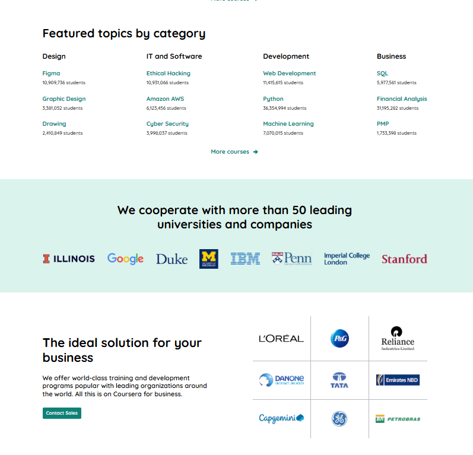

# Educational Landing Page

A static educational landing page built with **HTML5** and **CSS3**. This project demonstrates fundamental frontend development skills, including semantic HTML, modern CSS layout techniques, and clean code organization using the **BEM** methodology.

---

## 🚀 Live Demo

https://leysman.github.io/Educational-Landing-Page/

---

## 💻 Repository

https://github.com/Leysman/Educational-Landing-Page

---

## 📸 Preview

### Hero Section


### Other Sections

| Program Cards | Features & Partners |
| :-----------: | :-----------------: |
|  |  |

| Pricing & Students | Contact Form |
| :----------------: | :----------: |
|  |  |

---

## 🛠️ Technologies

- HTML5
- CSS3
- Semantic HTML
- BEM Methodology
- Flexbox
- CSS Grid

---

## ✨ Features

- Semantic HTML structure
- Multi-section landing page
- Reusable layout sections
- CSS Flexbox layouts
- CSS Grid layouts
- BEM methodology
- Contact form UI

> **Note:** This project is a static landing page without JavaScript functionality.

---

## 📚 What I Learned

During this project I practiced:

- Writing semantic HTML markup
- Structuring web pages using semantic elements
- Organizing styles with the BEM methodology
- Building layouts with Flexbox and CSS Grid
- Organizing project files and styles
- Writing clean and maintainable CSS

---

## 📂 Project Structure

```text
├── img/
├── preview/
│   ├── hero.png
│   ├── programs.png
│   ├── features.png
│   ├── pricing.png
│   └── contact.png
├── style/
│   ├── reset.css
│   ├── base.css
│   └── style.css
├── index.html
└── README.md
```

---

## 📄 License

This project was created for educational purposes.
